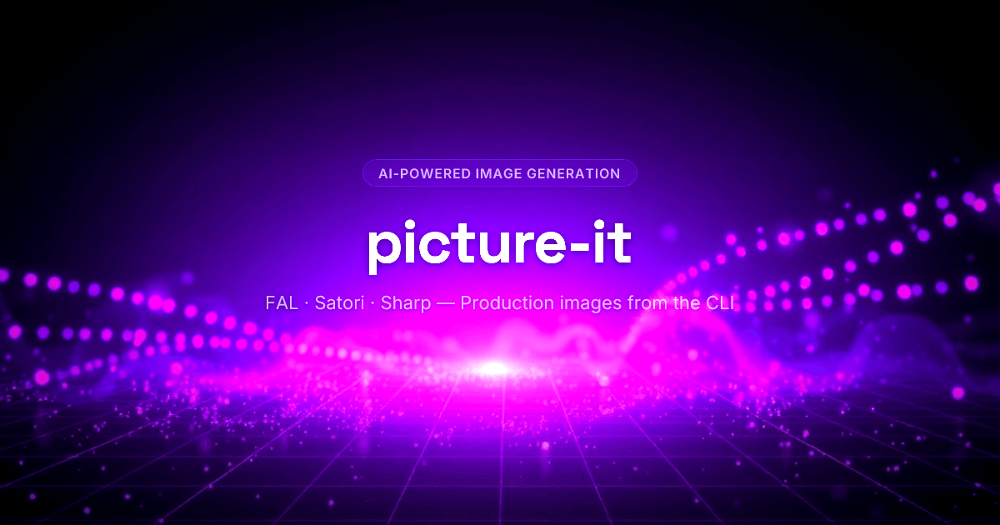

# picture-it



A CLI tool for AI agents to generate production-quality images. Uses FAL AI models for creative image generation and editing, Satori for pixel-perfect text rendering, and Sharp for compositing and post-processing.

## Setup

```bash
bun install
bun run download-fonts
```

Configure API keys (needed for `create` and `--review`):

```bash
bun run index.ts auth --fal <your-fal-key>
bun run index.ts auth --anthropic <your-anthropic-key>
bun run index.ts auth --status
```

Keys resolve in order: env vars > `~/.picture-it/config.json` > `.env`

## Commands

### template — No AI, instant output

Built-in templates that use Satori + Sharp only. No API keys needed.

```bash
# Text hero
bun run index.ts template text-hero \
  --title "Ship Faster" \
  --subtitle "With AI-powered tooling" \
  --badge "NEW" \
  --output hero.png

# VS comparison
bun run index.ts template vs-comparison \
  --left-logo hype.png \
  --right-logo competitor.png \
  --left-label "Hype" \
  --right-label "Other" \
  --glow-color "#7c3aed" \
  --output comparison.png

# Feature hero with logo
bun run index.ts template feature-hero \
  --logo icon.png \
  --title "Feature X" \
  --subtitle "Now available" \
  --glow-color "#3b82f6" \
  --output feature.png

# Social card
bun run index.ts template social-card \
  --title "Building AI-Powered CLIs" \
  --description "How we built it" \
  --site-name "example.com" \
  --author-name "Jane" \
  --output social.png
```

### create — AI-planned composition

Claude plans the layout, FAL generates backgrounds, Sharp composites everything.

```bash
bun run index.ts create \
  --prompt "Dark tech blog header showing Hype vs competitor" \
  --assets hype-logo.png competitor-logo.png \
  --preset dark-tech \
  --platform blog-featured \
  --output header.png \
  --review \
  --verbose
```

### compose — Manual overlay compositing

Composite overlays from a JSON file onto a background image.

```bash
bun run index.ts compose \
  --bg background.png \
  --overlays overlays.json \
  --size 1200x630 \
  --output result.png
```

### batch — Multi-image generation

```bash
bun run index.ts batch \
  --spec images.json \
  --output-dir ./blog-images/
```

## Flags

| Flag | Description |
|---|---|
| `--prompt` | Natural language description (required for create) |
| `--assets` | Input images (logos, screenshots, icons) |
| `--style` | Comma-separated style keywords |
| `--preset` | Style preset: `dark-tech`, `minimal-light`, `gradient-mesh`, `editorial`, `glassmorphism` |
| `--platform` | Platform preset (sets size + safe zones) |
| `--size` | Output dimensions, e.g. `1200x630` |
| `--output` | Output file path (extension sets format: png/jpg/webp) |
| `--model` | FAL model: `seedream` ($0.04), `banana2` ($0.08), `banana-pro` ($0.15) |
| `--grade` | Color grade: `cinematic`, `moody`, `vibrant`, `clean`, `warm-editorial`, `cool-tech` |
| `--grain` | Add film grain |
| `--vignette` | Add edge vignette |
| `--remove-bg` | Remove backgrounds from all assets via birefnet |
| `--review` | Enable Claude Vision self-review loop (max 2 retries) |
| `--no-fal` | Skip FAL, use gradient background |
| `--bg` | Pre-made background image (skips FAL) |
| `--verbose` | Detailed progress to stderr |

## Platform presets

| Preset | Size | Notes |
|---|---|---|
| `blog-featured` | 1200x630 | Default |
| `blog-inline` | 800x450 | |
| `og-image` | 1200x630 | Key content in center 1000x500 |
| `twitter-header` | 1500x500 | Center 60% safe |
| `instagram-square` | 1080x1080 | |
| `instagram-story` | 1080x1920 | |
| `linkedin-post` | 1200x627 | |
| `youtube-thumbnail` | 1280x720 | Avoid bottom-right 20% |
| `shopify-app-listing` | 1200x628 | |

## Output behavior

- **stdout**: only the output file path (or JSON array for batch)
- **stderr**: progress logs, warnings, review scores
- **Exit 0** on success, **Exit 1** on failure

This makes it easy for AI agents to consume: read stdout for the file path, ignore stderr.

## Architecture

```
User prompt
  ↓
Stage 0: Asset Analysis (Sharp — palette, transparency, content type)
  ↓
Stage 1: Planner (Claude Sonnet — JSON composition plan)
  ↓
Stage 1.5: Satori Pre-Render (text PNGs for FAL scene integration)
  ↓
Stage 2: FAL Generation (SeedDream/Banana/Flux — background + scene)
  ↓
Stage 3: Contrast Safety Check (auto-inject gradient overlays for readability)
  ↓
Stage 4: Overlay Compositing (Sharp — images, Satori text, shapes, watermarks)
  ↓
Stage 5: Post-Processing (color grade, grain, vignette)
  ↓
Stage 6: Review (Claude Vision — score + corrections, max 2 retries)
  ↓
Final image on disk
```

## Text rendering strategies

The planner picks per text element:

- **satori-to-fal**: Satori pre-renders text as PNG, FAL integrates it into the scene with natural lighting. Best for hero titles.
- **fal-direct**: Text instructions in FAL prompt only. Cheapest, works for short simple words.
- **satori-overlay**: Satori renders, Sharp composites flat on top. Pixel-perfect for UI text, watermarks, captions.

## Dependencies

- **Bun** — runtime
- **Commander.js** — CLI
- **Sharp** — image compositing, resizing, effects, post-processing
- **Satori** — JSX-to-SVG text rendering
- **@resvg/resvg-js** — SVG-to-PNG conversion
- **@fal-ai/client** — AI image generation and editing
- **@anthropic-ai/sdk** — AI planner and vision reviewer
- **dotenv** — .env file support
